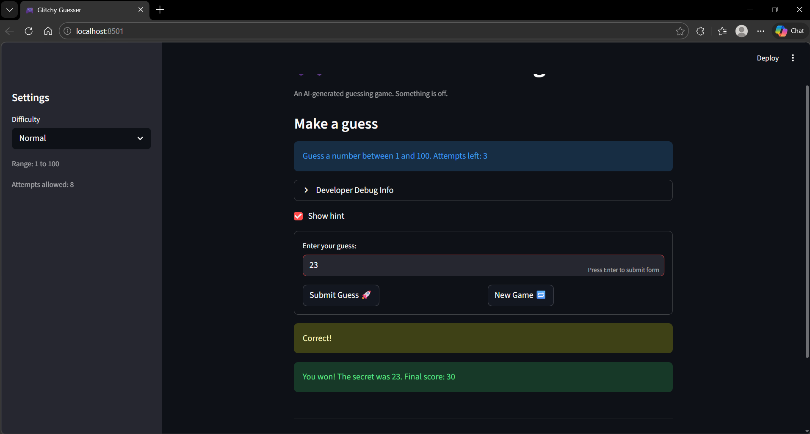
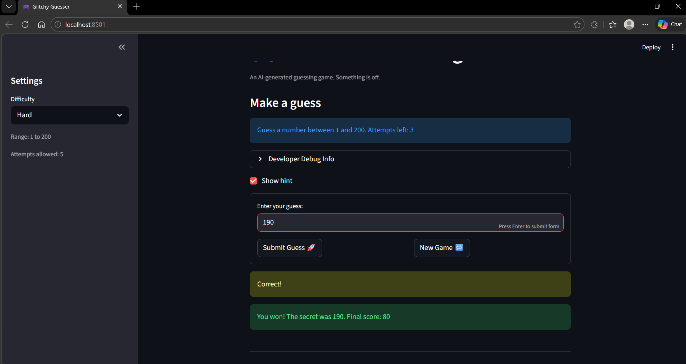

# 🎮 Game Glitch Investigator: The Impossible Guesser

## 🚨 The Situation

You asked an AI to build a simple "Number Guessing Game" using Streamlit.
It wrote the code, ran away, and now the game is unplayable.

- You can't win.
- The hints lie to you.
- The secret number seems to have commitment issues.

## 🛠️ Setup

1. Install dependencies: `pip install -r requirements.txt`
2. Run the broken app: `python -m streamlit run app.py`

## 🕵️‍♂️ Your Mission

1. **Play the game.** Open the "Developer Debug Info" tab in the app to see the secret number. Try to win.
2. **Find the State Bug.** Why does the secret number change every time you click "Submit"? Ask ChatGPT: _"How do I keep a variable from resetting in Streamlit when I click a button?"_
3. **Fix the Logic.** The hints ("Higher/Lower") are wrong. Fix them.
4. **Refactor & Test.** - Move the logic into `logic_utils.py`.
   - Run `pytest` in your terminal.
   - Keep fixing until all tests pass!

## 📝 Document Your Experience

- This is a number guessing game built with Streamlit where the player tries to guess a secret number within a limited number of attempts. The game has three difficulty levels: Easy (1–20), Normal (1–100), and Hard (1–200). Each with a different number of allowed attempts and range, and it tracks a score that changes based on how quickly and accurately you guess.

- When I first ran the game, it was pretty much unplayable. The hints were completely backwards for example if I guessed too low it would tell me to go lower, and if I guessed too high it would say go higher, so every guess just made things worse. On top of that, the secret number was changing on every single click because `random.randint` was being called at the top of the script with no session state protection, so Streamlit was regenerating it every time the page reran. The new game button also didn't actually start a new game because it wasn't resetting the `status` back to `"playing"`, so the app would immediately hit the game-over block and freeze. The Hard difficulty was also broken in two ways: the range was only 1–50, which is actually easier than Normal, and the UI still showed "1 to 100" no matter what difficulty you picked. There was also an off-by-one bug where the attempts counter started at 1 instead of 0, making the display show one fewer attempt than was actually allowed.

- To fix everything, I first wrapped the secret number generation in an `if "secret" not in st.session_state` check so it only runs once per game. I fixed the hint logic by removing the broken even/odd attempt type-coercion that was converting the secret to a string and messing up comparisons. Now `check_guess` always gets the actual integer. I also fixed the `check_guess` unpacking error where `app.py` was trying to unpack a single return string into two variables. The new game button was fixed by resetting `status`, `history`, and `attempts` all together, and using `low`/`high` from the current difficulty instead of a hardcoded 1–100. The Hard range was bumped to 1–200 so it's actually harder than Normal. I wrapped the input and submit button in a `st.form` so pressing Enter submits a guess. Finally, I initialized `attempts` to `0` so the displayed count matches what the sidebar shows from the start.

## 📸 Demo

- [ ] 
- [ ] 
- [ ] 

## 🚀 Stretch Features

- [ ] [If you choose to complete Challenge 4, insert a screenshot of your Enhanced Game UI here]
